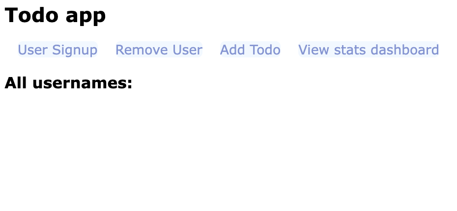

# 📝 Todo List Application

This README will guide you through the two-part assignment for the TODO List application.

## Table of Contents

1. [📋 Assignment Overview](#📋-assignment-overview)
1. [⚙️ Check your installation](#⚙️-check-your-installation)
1. [🏗️ Part 1: SQL Query Development](#🏗️-part-1-sql-query-development)
1. [🔍 Checking your SQL queries](#🔍-checking-your-sql-queries)
1. [🖼️ Part 2: Integration with the Todo List UI](#🖼️-part-2-integration-with-the-todo-list-ui)
   - [Viewing the Todo List UI](#viewing-the-todo-list-ui)
   - [Locating Files to Edit](#locating-files-to-edit)
   - [Integrating SQL Queries](#integrating-sql-queries)
1. [🔄 Resetting the Database](#🔄-resetting-the-database)
1. [✅ Acceptance Criteria for Query Outputs](#✅-acceptance-criteria-for-query-outputs)
1. [🧪 Verifying your database functions](#🧪-verifying-your-database-functions)
   - [🔭 Logging output](#🔭-logging-output)
   - [🖥️ Using the user interface](#️🖥️-using-the-user-interface)
1. [📝 Additional Notes](#-additional-notes)

## 📋 Assignment Overview

This assignment is divided into two parts:

1. **Part 1: SQL Query Development**

   - Create SQL commands to set up database tables
   - Write SQL queries to retrieve and manipulate data according to the business requirements
   - Test the SQL queries using sqlite3

2. **Part 2: Integration with Todo List UI**
   - Integrate the SQL queries from Part 1 into the provided Todo application
   - Implement the queries in the appropriate JavaScript files
   - Test the integration using the Todo List UI

## ⚙️ Check your installation

We recommend using a [GitHub Codespace](https://docs.github.com/en/codespaces/overview) as your development environment for this project. If you create a Codespace using this repository it should automatically install the core applications and dependencies you need to get started with this assignment. However you should check that you have the correct software installed in your codespace before starting the assignment.

1. Check you have `sqlite3` installed in your project:

```terminal
sqlite3 --version
```

2. Check you have node installed in your project:

```terminal
node -v
```

## 🏗️ Part 1: SQL query development

In this part, you will focus on writing SQL queries to set up the database tables, insert sample data and retrieve data according to the query requirements.

### Database Schema

Create the following tables in your database. We have provided a file `setup.sql` inside the `part-1` folder where you can create tables and insert data using SQL.

#### `users` table

- `email_address`: VARCHAR, Primary Key
- `first_name`: VARCHAR
- `last_name`: VARCHAR
- `notification_ind`: CHAR(1)

#### `todos` table

- `id`: INTEGER, Primary Key, Auto-increment
- `email_address`: VARCHAR, Foreign Key referencing users(email_address)
- `title`: VARCHAR
- `content`: VARCHAR
- `priority`: CHAR(1)
- `created_at`: TIMESTAMP
- `is_complete`: INTEGER (0 or 1)


Once you've created your tables, you'll need to insert some users and todos into your database to check that your tables are defined correctly.

### Required SQL Queries

Write SQL queries for the following operations. We have provided a file `queries.sql` inside the `part-1` folder where you can write the queries for each operation. For each query, the expected output format is described.

1. Retrieve all fields from the users table

- Output: A result set with columns:

  ```
     email_address | first_name | last_name | notification_ind
  ```

2. Retrieve all users with their todos

- Output: A result set with columns from the todos and the users table:
  ```
  first_name | last_name | email_address | content | title
  ```

3. Retrieve a todo by id

   - Output: A single row result set with columns:
     ```
     id | email_address | title | content | priority | created_dt | is_complete
     ```

4. Insert a new user

   - Output: No result set, but the user should be added to the `users` table

5. Insert a new todo for a user

   - Output: No result set, but the todo should be added to the `todos` table

6. Update a todo

   - Output: No result set, but the specified todo should be updated in the `todos` table

7. Remove a user and their todos

   - Output: No result set, but the user and their associated todos should be removed from the database

### Required aggregate queries

For queries using aggregate functions (like SUM, COUNT, AVG, etc.), you should provide an **alias** for the column that contains the aggregate result.

1. Count the total number of users

   - Output: A single row, single column result set:
     ```
     total_users
     ```

1. Count the total number of todos

   - Output: A single row, single column result set:
     ```
     total_todos
     ```

1. Count the number of todos per user

   - Output: A result set with columns:
     ```
     email_address | todo_count
     ```

1. Count the number of todos by priority for each user

   - Output: A result set with columns:
     ```
     email_address | urgent | high_priority | medium_priority | low_priority
     ```

1. Find the user with the most todos

   - Output: A single row result set with columns:
     ```
     email_address | todo_count
     ```

1. Find the user with the least todos

   - Output: A single row result set with columns:

     ```
     email_address | todo_count

     ```

1. Calculate the average number of todos per user
   - Output: A single row, single column result set:
     ```
     avg_todos_per_user
     ```

When testing these queries, make sure the output matches the described format. This will ensure that the queries will integrate smoothly with the Todo List application in Part 2 of the assignment.

## 🔍 Checking your SQL queries

`sqlite3` has a CLI (command line interface) which we can use to interact with our Sqlite databases. You can check your SQL queries by running your `.sql` files with the `sqlite3` CLI.

| ℹ️ Double check you have `sqlite3` installed in your codespace. Open a terminal and run `sqlite3 --version` to check you get the sqlite3 version in the command output.

To run any `.sql` file with `sqlite3`, you can:

1. Change into the directory where the file is located.
2. Double check your `.sql` file opens a database using the `.open` statement.
3. Open a terminal and use the `sqlite3` command-line tool:
   ```terminal
   sqlite3 < <name-of-file>.sql
   ```
4. Check the query output when you run the command

For example, to run the file `setup.sql` located in `part-1`. You can:

1. Change directory into the `part-1` directory
2. Open a terminal and run the following command:

```terminal
  sqlite3 < setup.sql
```

3. Check the query output when you run the command

## 🖼️ Part 2: Integration with the Todo list UI

In this project, we're building a Todo list UI that enables users to view a list of their todos. Through the UI, users can add more todos, edit existing ones, sign up new users and view a stats page that shows information like the total number of todos per user. In this part, you will integrate the SQL queries you developed in Part 1 into the Todo List application so the frontend can communicate with the database.

### 📦 Install the project dependencies

You will need to install some libraries for your todo app project to work. Start by opening a terminal and then run the following command to install your dependencies:

```terminal
npm install
```

Then check the installation worked:

```terminal
npm ls
```

This should print something like the following to your terminal:

```terminal
nodejs@1.0.0 /workspaces/DAT1-todo-app
├── @types/node@18.19.43
├── body-parser@1.20.2
├── express-handlebars@6.0.7
├── express-session@1.18.0
├── express@4.19.2
├── jest@29.7.0
├── node-fetch@3.3.2
├── nodemon@3.1.4
├── prettier@3.3.3
├── sqlite@4.2.1
└── sqlite3@5.1.7

```

### Viewing the Todo List UI

1. Start the todo application frontend by running:

```terminal
npm run listen
```

1. Open a web browser and go to `http://localhost:3000` to view the TODO list UI.

1. Check the UI looks like this:



### Locating Files to Edit

The files you'll need to edit are inside the `db` folder:

1. `setup.js`: This file contains code to create tables and insert data.
2. `helpers.js`: This file contains helper functions for database operations.
3. `aggregates.js`: This file contains functions for aggregating data from the database.

### 🔌 Integrating SQL Queries

In each of the files mentioned above, you'll find JavaScript functions where you need to insert your SQL queries. For example:

```javascript
fetchUsers = async () => {
  const result = await this.db.all(
    `

   `,
  );
  return result;
};
```

Insert your SQL queries in between the backticks to complete this function.

## 🔄 Resetting the Database

If you're working with a local development database, you may want to reset the database back to an initial state after adding data to it.

To reset the database to its initial state, use the following script:

```bash
   npm run setup:db
```

## ✅ Acceptance Criteria for query outputs

### `db/setup.js`

Your first task will be to create the tables `users` and `todos` for the todo application. You will need to edit the `createTables` and `insertData` functions located in the `setup.js` file in the `db` directory. You can check this is working by running:

```terminal
  npm run setup:db
```

This script will call the `createTables` and `insertData` functions from `initialise.js` to setup your development database.

### `db/helpers.js`

When implementing the required functions in `db/helpers.js`, ensure that your function outputs match the following criteria exactly:

1.  `fetchUsers()`:

- Returns an array of all user objects from the database

```javascript
[
  {
    email_address: "user@example.com",
    first_name: "User",
    last_name: "Name",
    notification_ind: null,
  },
  // ... more users
];
```

2.  `fetchUsersAndTodos()`:

    - Returns an array of users objects, each representing a todo with its associated user:

```js
[
  {
    id: 1,
    first_name: "Steve",
    content: "Do homework",
    title: "Homework",
    email_address: "steve@ada.ac.uk",
    is_complete: 1,
  },
  // .
  // .
  // .
];
// ... more users with their todos
```

3.  `fetchTodoById(todoId)`:

- Returns a single todo object matching the given ID:

```json
{
  "id": 1,
  "email_address": "user@example.com",
  "priority": "H",
  "title": "Todo title",
  "content": "Todo content",
  "created_at": null,
  "is_complete": 0
}
```

4.  `insertUser({ emailAddress, firstName, lastName, notificationInd })`:

    - Inserts a new user into the database.

5.  `insertTodo({ emailAddress, title, content, priority })`:

    - Inserts a new todo into the database.

6.  `updateTodo({ title, content, priority, todoId, isComplete })`:

    - Updates an existing todo in the database.

7.  `removeUser(emailAddress)`:
    - Removes a user and their associated todos from the database.
    - Returns the result of the database operation (implementation-specific).

### `db/aggregates.js`

When implementing the required queries in `aggregates.js`, ensure that your function outputs match the following criteria exactly:

1. `totalUsers()`:

- Gives the total number of users. Returns a single object with the following structure:
   
```json

{"total_users": 3}
```

2. `totalTodos()`:

- Gives the total number of todos. Returns a single object with the following structure:

```json
{"total_todos": 6}
```

3. `todosPerUser()`:

- Returns an array of objects, each with the following structure:

```json
{ "email_address": "user@example.com", "total_todos": 5 }
```

4. `todosPerPriority()`:

- Returns an array of objects, each with the following structure:

```js
[
  {
    email_address: "user@example.com",
    urgent: 1,
    high_priority: 2,
    medium_priority: 3,
    low_priority: 1,
  },
  // ... more priority counts in this form
];
```

5. `emailOfMaxTodos()`:

- Gives the first user email with the maximum number of todos. Returns a single object with the following structure:

```json
{
  "email_address": "user@example.com",
  "max_todos": 10
}
```

6. `emailOfMinTodos()`:

- Gives the first user email with the minimum number of todos. Returns a single object with the following structure:

```json
{
  "email_address": "user@example.com",
  "min_todos": 2
}
```

7. `avgTodosPerUser()`

- Gives the average number of todos per user. Returns a single object with the following structure:

```json
{
  "avg_todos_per_user": 1.2
}
```

Note: this function can return a `min_todos` of `0` if there are no todos associated with a given user. If there are multiple users with the same minimum then it should return the first user

## 🧪 Verifying your database functions

### 🧵 Checking the json output from queries

When writing queries with `sqlite3`, we can use `json` mode to format the query output as json instead of tables. In this mode, each row of the query output will be a JSON object. We can set this mode in `sqlite3` with the following command:

```terminal
.mode json
```

We can check some of our queries from part 1 return correctly formatted json before integrating them into our database functions. 

### 🔭 Logging output

For some database functions, you can verify your queries are working correctly by checking the output inside the function. This works for functions that retrieve data or use an aggregate function to compute a value. For example, you can add a `console.log` statement to check the output is what you expect:

```javascript
fetchUsers = async () => {
  const result = await this.db.all(
    `

   `,
  );
  console.log(result, "<----result");
  return result;
};
```

### 🖥️ Using the user interface

To ensure your query implementations in `setup.js`,`helpers.js` and `aggregates.js` are working correctly, you can interact with the application's frontend UI. This hands-on approach will help you verify that data is being persisted and retrieved correctly.

1. If you've not got a database setup, create a fresh database with tables and sample data

```terminal
npm run setup:db
```

2. Start the todo application frontend:

```terminal

npm run listen

```

3. Open your web browser and navigate to `http://localhost:3000`

4. Use the following UI features to test your implementations:

#### Return all users

- Navigate to the home page on localhost:3000
- Check the **All usernames** section of the UI
- Check it displays the usernames of all users in your database
- This checks that `fetchUsers` in `db/helpers.js` is working

#### Return todos and users

- Navigate to the home page on localhost:3000
- Check the **All user todo lists:** section of theUI
- It should display all the users and a list of their todos
- This checks that `fetchUsersAndTodos` in `db/helpers.js` is working

#### Return todo by ID

- Navigate to the home page
- Check you can view the list of todos for each user
- Click on the pencil icon to edit the a todo
- It should navigate to a form with auto-populated fields for the chosen todo you want to edit
- This checks that `fetchTodoById` is working correctly

#### User Signup

- Click on "User Signup" and fill out the form with a new user's details.
- After submission, check if the new user appears on the main page with an empty todo list.
- This tests the `insertUser` function in `db/helpers.js`.

#### Add Todo

- Click on "Add Todo" and create a new todo for an existing user.
- Verify that the new todo appears in the user's list on the main page.
- This tests the `insertTodo` function in `db/helpers.js`.

#### Edit Todo

- Click the edit icon (pencil) next to an existing todo.
- Modify the todo and save the changes.
- Check if the updates are reflected on the main page.
- This tests the `updateTodo` function in `db/helpers.js`.

#### Remove User

- Click on "Remove User" and enter an email address to remove.
- Verify that the user and their todos disappear from the main page.
- This tests the `removeUser` function in `db/helpers.js`.

#### 📊 View Stats Dashboard

- Click on "View stats dashboard" to see aggregated data.
- Check if the statistics match your expectations based on the current data.
- This tests various functions in `aggregates.js`, including `totalUsers`, `totalTodos`, `todosPerUser`, and `todosPerPriority`.

1. After each operation, you can use the sqlite3 command-line tool (as described in the "Checking Database State with sqlite3" section) to directly verify the database state.
1. If you notice any discrepancies between the UI, the database state, and your expected results, review and debug your query implementations.

Remember to test edge cases, such as:

- Adding todos for users with no existing todos
- Removing the last todo for a user
- Adding and removing users with various numbers of todos

By systematically testing each feature in the UI and cross-referencing with direct database queries, you can ensure that your implementations are correct and robust.

## 📝 Additional Notes

- Make sure to run `npm run listen` after resetting the database to see the changes reflected in the UI.
- If you encounter any issues, ensure that all dependencies are correctly installed and that you're in the correct directory when running the commands.
- Regularly check your query outputs against the provided acceptance criteria to ensure accuracy.
- When implementing database operations, pay attention to error handling and edge cases to make your code more robust.

Happy coding and testing!
